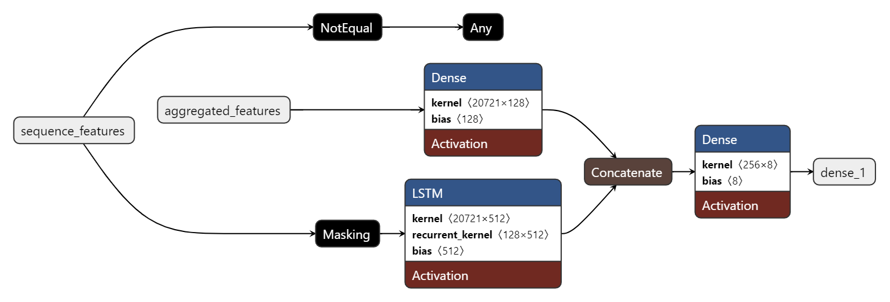

# Combatting the impact of unconsented data using machine learning

## Introduction

Digital campaigns are expensive, and accurate measurement of user interactions is key to understanding which channels drive performance. However, with growing privacy settings and users opting out of cookie tracking, much of your data can lack channel information. This gap can distort your attribution models, potentially leading you to underestimate some channels and over-invest in others.

While solutions like Google’s [Consent Mode](https://support.google.com/google-ads/answer/10000067?hl=en-GB) provide a high-level statistical approach to filling these gaps, they often apply a one-size-fits-all strategy that may not capture the nuances of your specific data. There is a need for a more tailored solution, one that constructs a detailed picture of each user journey by linking and understanding all available event data (including campaign parameters, device information, geotargeting, and other user signals). 

This model implementation is designed to address this challenge. It learns from complete user journeys (where the channel is known) and uses that knowledge to predict the most likely channel for journeys with missing data. Through cross-validation, the model ensures that its predictions are both explainable and reliable, providing you with transparent insights that empower smarter, data-driven decisions and optimise your marketing investments.


## Proprietary Model for Channel Imputation

`prop_model_app.py`

Provides an end-to-end pipeline that uses event-level data from Google BigQuery to train a dual-input deep learning model for channel imputation. The model learns from both aggregated journey features and the sequence of events in each user journey to predict the dominant channel (e.g., Direct, Email, Organic Search, etc.).

### Overview

**Data Ingestion:**  

The process begins by authenticating with Google Cloud using a service account key and querying event-level data from BigQuery.

**Data Preprocessing:**

User journeys are constructed by grouping and chronologically ordering user events retrieved from BigQuery. Each event is transformed into a rich set of features, including: event details, campaign metadata, device and geographic information, and custom event parameters. Two types of feature representations are derived for each journey. The first representation consists of aggregated features, where, for a selected portion of the journey (typically the middle events), features are summed using counters to capture overall trends and behaviour. The second representation consists of sequential features, in which the per-event features are preserved in their original order. These sequences are then padded or truncated to a fixed length to maintain temporal consistency. Before training, these feature dictionaries are vectorised using a [DictVectorizer](https://datascientest.com/en/dense-neural-networks-understanding-their-structure-and-function) to convert categorical and numerical data into dense numerical arrays.

**Model Architecture:**

The model employs a dual-input deep learning architecture designed to capture both the overall behavioural trends and the detailed temporal dynamics of user journeys. In the aggregated features branch, the aggregated feature vector is fed into a dense neural layer with 128 units and ReLU activation, summarising the overall journey into a compact representation. This process is akin to creating a [summary vector](https://neptune.ai/blog/understanding-vectors-from-a-machine-learning-perspective) that encapsulates key trends. In parallel, the sequential features branch processes the ordered event data by first applying a Masking layer to ignore any padded values, and then utilising an [LSTM layer](https://machinelearningmastery.com/gentle-introduction-long-short-term-memory-networks-experts/) with 128 units to learn temporal patterns and dependencies within the event sequence. After processing through their respective branches, the outputs are concatenated and passed to a final dense layer with a [softmax output](https://en.wikipedia.org/wiki/Softmax_function) to predict the channel for the journey.

**Training and Evaluation:**

The model is trained on journeys with complete channel information, where the dominant channel is determined by the most frequent channel in the journey's middle events. An 80:20 split between training and validation sets ensures robust evaluation on unseen data. The model is optimised using the [Adam optimiser](https://machinelearningmastery.com/adam-optimization-algorithm-for-deep-learning/) with a learning rate of 0.001, while minimising the [categorical cross-entropy loss](https://www.v7labs.com/blog/cross-entropy-loss-guide). Early stopping is employed to prevent overfitting by monitoring validation loss and restoring the best model weights. The training runs for 10 [epochs with a batch](https://machinelearningmastery.com/difference-between-a-batch-and-an-epoch/) size of 32. This dual-input design, which integrates both aggregated and sequential analyses, enables the model to capture a nuanced understanding of user behaviour for improved channel prediction.

Each unit (or neuron) in a layer performs a simple mathematical operation: it takes a set of inputs, multiplies each by a learned weight, sums them together [adding a bias](https://www.turing.com/kb/necessity-of-bias-in-neural-networks), and then applies a non-linear activation function [ReLU](https://machinelearningmastery.com/rectified-linear-activation-function-for-deep-learning-neural-networks/) to produce an output. In dense layers, every neuron does this independently for all inputs, allowing the network to learn complex combinations of features. In LSTM layers, each unit is part of a more complex cell that uses [gating mechanisms](https://d2l.ai/chapter_recurrent-modern/lstm.html) to control the flow of information over time, which lets the network capture temporal dependencies and patterns in sequential data.

A [kernel](https://dida.do/blog/what-is-kernel-in-machine-learning) is a function that allows linear methods to solve nonlinear problems by transforming data into higher-dimensional spaces, where patterns are easier to identify. In neural networks, the term "kernel" also refers to the weight matrices within layers. For example, in dense layers, the kernel is the matrix of weights that multiplies the input features, enabling the layer to learn complex combinations of inputs. Similarly, in LSTM layers, the kernel transforms the input at each timestep, while a recurrent kernel processes the hidden state from previous timesteps to capture temporal dependencies. These kernels are learned during training, allowing the network to adapt and extract meaningful patterns from the data.

Overfitting occurs when a model learns not only the underlying patterns in the training data but also the noise, causing it to perform well on the training set while poorly generalising to unseen data. Something we aim to avoid, therefore we do not over set parameters (reason behind not setting units or batch size etc really high).

**Model Overview Visualised:**



**Imputation:**  
Once the model is trained, it is used to predict missing channel values in journeys where this information is absent. For each incomplete journey, the same feature extraction and vectorisation process used during training is applied. The model then processes these inputs to predict the channel, effectively filling in the gaps in the data. The script automatically updates the journey records with these imputed channel values, and the final, enriched dataset is exported. This imputation process helps to reconstruct a more complete picture of user journeys, which in turn enables more accurate attribution analysis and better-informed decision-making in your digital campaigns.

### Hyperparameters

- MAX_SEQ_LENGTH:
This defines the maximum number of events (the sequence length) considered in each user journey. Sequences shorter than this are padded, and longer sequences are truncated. Adjusting this value changes how much sequential information is fed into the model. This is done so that all sequences have a consistent shape before being fed into the model.

- EPOCHS:
The number of complete passes through the training data during model training. Increasing this number can allow the model more opportunities to learn, but may risk overfitting, whereas reducing it may lead to underfitting.

- BATCH_SIZE:
The number of samples processed before the model's weights are updated. A larger batch size might lead to more stable gradient updates but requires more memory, while a smaller batch size can result in noisier updates and potentially slower convergence.

- LEARNING_RATE:
This is the step size used by the optimiser (Adam in this case) when updating the model’s weights. A higher learning rate can accelerate training but may overshoot optimal values, while a lower rate might yield a more precise convergence at the cost of slower training.

- RANDOM_STATE:
A seed value used for random number generation to ensure reproducibility of the model training and data splitting. Changing this value will result in different random splits and model initialisations, which could affect performance outcomes.

- TEST_SIZE: 
The split of data that is kept away from the building to test the build against. This can be altered up or down based on the effectiveness of model building, and is worth considering to move up when the data set increases (currently at 20%).

## Local Setup and Running

Follow these simple steps to run the scripts on your local machine:

1. **Clone the Repository:**
   ```bash
   git clone https://github.com/wgw0/bq_modelling.git
   cd bq_modelling
   ```

2. **Create a Virtual Environment:**
   Create a virtual environment using Python (ensure you have Python **3.10.x** installed):
   ```bash
   python -m venv .venv
   ```

3. **Activate the Virtual Environment:**
   - **Windows:**
     ```bash
     .\.venv\Scripts\activate
     ```
   - **macOS/Linux:**
     ```bash
     source .venv/bin/activate
     ```

4. **Install Dependencies:**
   Install all required packages with:
   ```bash
   pip install -r requirements.txt
   ```

5. **Configure Your Google Cloud Credentials:**
   - Place your `service-account-key.json` file in the repository’s root directory.
   - Ensure the scripts (e.g., in `prop_model_app.py`) reference the correct path to this key.

6. **Run the Scripts:**
   - To run the advanced proprietary model for channel imputation:
     ```bash
     python prop_model_app.py
     ```
